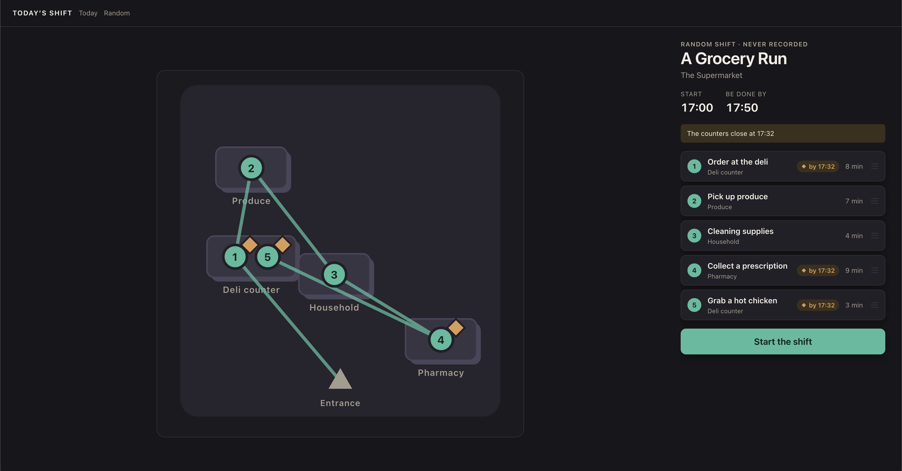
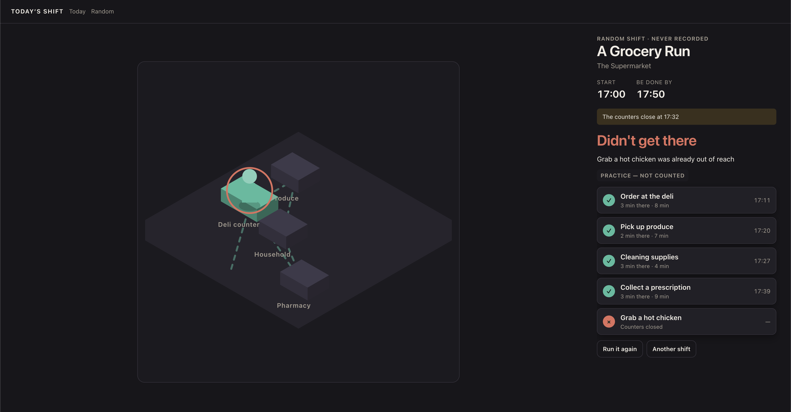
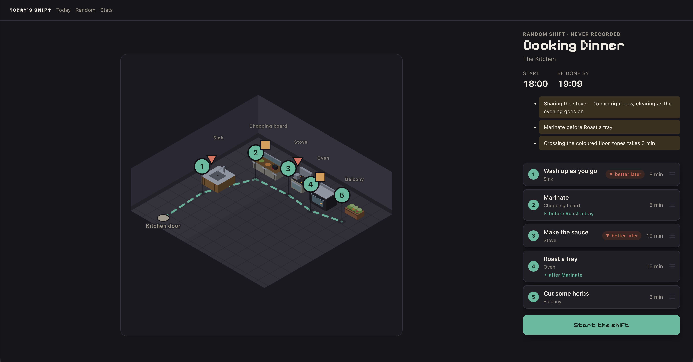

# Process overview

This file is the shape; the course site's
[assessment page](https://comp.anu.edu.au/courses/comp4020-agentic-coding-studio/topics/assessment/#what-you-submit)
is the requirement, and its
[word counts](https://comp.anu.edu.au/courses/comp4020-agentic-coding-studio/topics/assessment/#word-counts)
cover every deliverable.

## What I built

Today's Shift: a task planning game that players must solve by ordering a list of tasks, some of which may have constraints, to meet a deadline.
After ordering, the players watch as the plan executes with a 3D map visualisation, and see if they have met the deadline.
Inspired by Wordle and similar games, I created daily puzzles, called _Shifts_, with stats such as streaks, to encourage the player to come back for a few days in a row.
Each day, the puzzle is randomised, with different scenes, tasks, constraints, and deadlines.
The puzzles also vary throughout the week, with more routine activities like working, grocery shopping, and going to the gym on weekdays, and more leisurely activities on the weekend.

## The moments that mattered

### Making the scenes more realistic

The problem was that even though at the beginning, I had told the agent to adopt a "lofi/low-poly" design aesthetic, it leaned too much into the low-poly theme, and the visuals felt too cheap and boring.
Furthermore, every scene was generic, and layouts felt arbitrary and non-realistic. 

The obvious thing to do would've been to keep re-prompting until I got the desired design.
But there were other design issues such as 3D object layering problems and unrealistic shelves where items were bunched in one corner.
To resolve all of these problems at once, I prompted the agent to incorporate the design choices and realism requirements into `CLAUDE.md`, and also add sensors where appropriate.

The new sensors eventually passed, and I manually checked the website at the two marked viewpoints, verifying the design was as I had desired. 
It had indeed adopted a more lofi-inspired design, with more colour, texture, and details for each object.
The agent also took the additional liberty of adding a "retro-like" typeface, adding to the personality of the game.

[`a7f02a1...e4f5a6b`](https://github.com/comp4020-agentic-coding-studio/comp4020-crit5-attwelveDev/compare/a7f02a1...44cce5d)